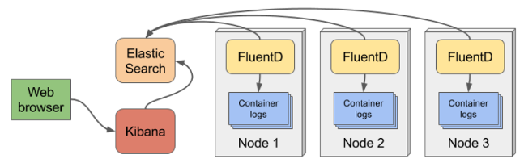

This is a demo on [fluentd](https://www.fluentd.org/) logging layer using Docker.

- Create a volume for ElasticSearch:  

    **docker volume create elasticsearch**

- Configure proper files (in conf folder) if needed.

- Build a docker image for fluentd from Dockerfile (tag it fluent/fluentd:v1.1.2-gems)

- Run **docker-compose up**
